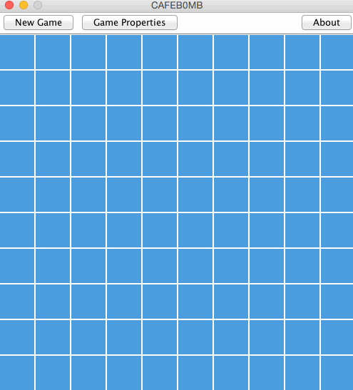

# WIP

# CAFEB0MB [](https://travis-ci.org/jomo/CAFEB0MB)

A Minesweeper game.
It's a project for school that has to be written in Java.



## Building

Simply run:
```shell
gradle build
```

To start the game:
```shell
java -jar build/libs/minesweeper.jar
```

## License

[WTFPL](LICENSE)